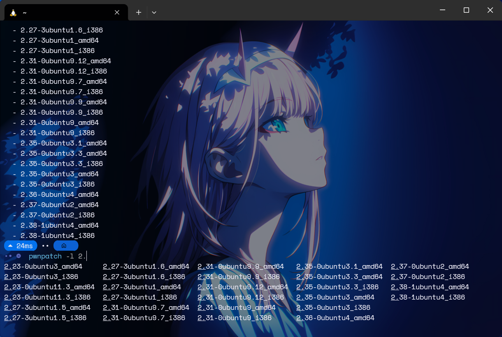

<div align='center'>
  <h1> pwnpatch</h1>
  <p>A simple wrapper for <a href="https://github.com/matrix1001/glibc-all-in-one">glibc-all-in-one</a>, with auto-completions for <a href="https://github.com/fish-shell/fish-shell">fish</a></p>


  
</div>

## Install
```fish
mkdir -p ~/.local/bin
curl -fsSL https://raw.githubusercontent.com/MuelNova/pwnpatch/main/pwnpatch -o ~/.local/bin/pwnpatch
curl -fsSL https://raw.githubusercontent.com/MuelNova/pwnpatch/main/pwnpatch.fish -o ~/.config/fish/completions/pwnpatch.fish
chmod +x ~/.local/bin/pwnpatch

echo "export PATH=$PATH:$HOME/.local/bin" >> ~/.config/fish/config.fish
```

## Configuration
脚本使用 `$GLIBC_DIRS` 环境变量作为查找路径，默认为 `/usr/share/glibc-all-in-one/libs/`

## Usage
```
pwnpatch -l <directory_name> [-p <patchelf_options>] <elf_file>

e.g. $ pwnpatch -l 2.31-0ubuntu9_amd64 note
```

## How it works
它会找到 `$GLIBC_DIRS` 下的所有文件夹，指定文件夹名字和附件后，它会查找 ld，然后运行
```
patchelf --set-rpath $GLIBC_DIRS/$DIR_NAME --set-interpreter $GLIBC_DIRS/$DIR_NAME/ld-*.so [OTHER_PATCHELF_OPTIONS] <ATTACHMENT>
```
